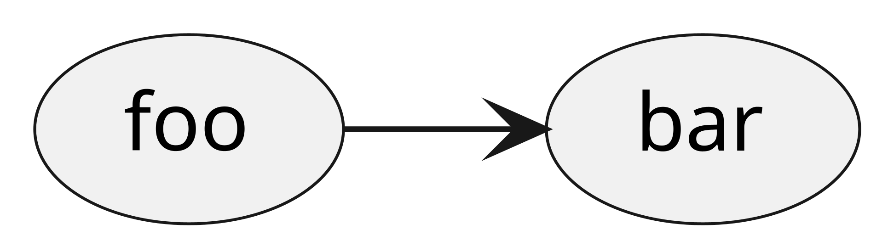

<!-- AFTER #collectServiceItems -->

# Tracking Links

> Lily has noticed something she wants to remember for later.
> This is going to require that writing instrument and bookmark or paper.
>
> In the _fate:code_ block below there's a few new commands, starting with `TRACK LINKED`.
> The word after those (for now, `memories`) is an _identifier_.
> Identifiers are useful in programming when you have more than one thing to track and need to distinguish between them.
>
> The `LINKED` keyword before the identifier tells you that memories store linked information.
> You'll need to write down these links lor later.
> On your paper, jot down something like this:



```fatecode
// I need to keep track of some things
TRACK LINKED memories

// Links relate two concepts.
// Can't do anything with this yet,
// but it might be relevant later.
LINK memories FROM "foo" TO "bar"

JUMP #rejoinAfterChoices
```
